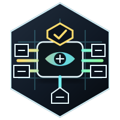
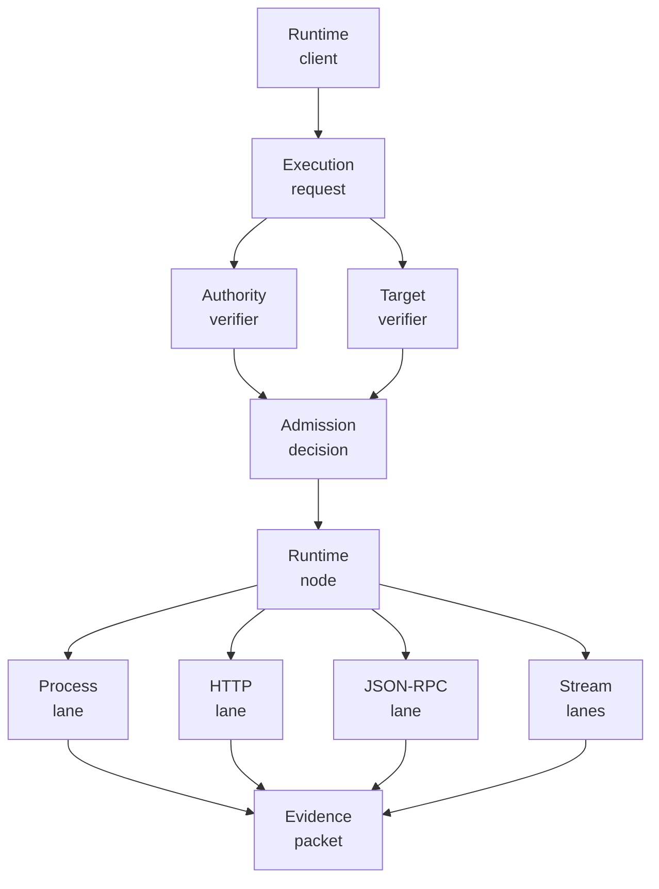
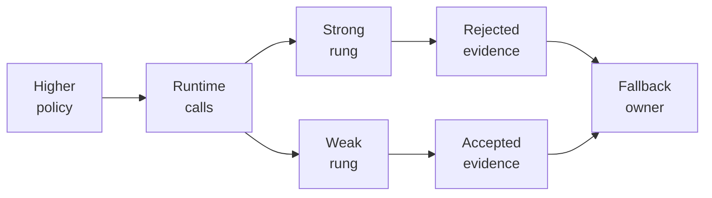

<p align="center">
  
</p>

<p align="center">
  <a href="https://github.com/nshkrdotcom/execution_plane">
    
  </a>
  <a href="https://github.com/nshkrdotcom/execution_plane/blob/main/LICENSE">
    
  </a>
</p>

# Execution Plane Workspace

This repository is a non-umbrella Mix workspace. The repository root is a
tooling project only; it is not the `execution_plane` Hex package.

The publishable common substrate package lives at `core/execution_plane`.
Blitz and workspace orchestration live only in the root project so they cannot
enter the published `execution_plane` package dependency graph.

Execution Plane is the lowest runtime substrate in the ranked stack. It owns
packets, lane protocols, placements, target attestations, runtime-client
contracts, and raw lower evidence. It does not own product intent, governance
policy, connector semantics, or durable workflow truth.

## Stack Position

```text
products / AppKit / Mezzanine / Citadel / Jido Integration
  -> ExecutionPlane.Runtime.Client
      -> execution_plane_node
          -> process, HTTP, JSON-RPC, SSE, WebSocket, terminal lanes
              -> concrete runtimes and targets
```

Higher layers decide why something should run and what authority applies.
Execution Plane decides whether a lower execution request is structurally
valid, whether the target and attestation are acceptable, which lane can carry
the request, and what lower evidence packet describes the result.

The node is intentionally lane-neutral. It can route to registered lanes and
verified targets, but it must not invent fallback ladders or infer business
semantics. If a policy owner allows multiple target classes, that owner issues
separate runtime-client calls and records each rejected or accepted rung.

## What The Common Package Carries

The publishable `execution_plane` package carries shared lower values and
behaviours:

- admission requests, decisions, and rejections
- authority refs and host-registered authority verifiers
- sandbox profiles and acceptable attestation classes as opaque policy data
- target descriptors, target attestations, target clients, and target verifiers
- execution requests, results, events, refs, evidence, and provenance
- placement descriptors for local, SSH, and guest targets
- lane adapter behaviours and capability descriptions
- lower-boundary simulation and conformance helpers

The common package does not enforce an OS sandbox by itself. It carries policy
and evidence. Real isolation claims must come from a verified target and a
lane/host implementation that can substantiate the attestation.

## Current Delivery State

The current checkout has a usable common package, process lane, HTTP lane,
JSON-RPC lane, SSE/WebSocket stream lanes, runtime node, and operator-terminal
package. StackLab currently proves node composition through local process/HTTP
execution, target-attestation rejection, authority rejection, and Jido
Integration-owned fallback evidence.

Recent work fixed dependency-source fallback behavior, added the local TRE Rhai
runner lane under the process package, added target posture attach contracts,
required lower authority refs, governed process environment inheritance, and
cleaned up atom/regex/env hazards.

## Runtime Diagrams





## Mix Projects

The checkout contains exactly eight active Mix projects:

- `core/execution_plane`: publishable `execution_plane` common substrate
- `protocols/execution_plane_http`: unary HTTP lane
- `protocols/execution_plane_jsonrpc`: JSON-RPC framing and correlation lane
- `streaming/execution_plane_sse`: SSE framing and stream lifecycle lane
- `streaming/execution_plane_websocket`: WebSocket handshake/frame lane
- `runtimes/execution_plane_process`: process/PTY/stdio lane, the sole owner
  of `erlexec`
- `runtimes/execution_plane_node`: lane-neutral runtime node and local
  `ExecutionPlane.Runtime.Client`
- `runtimes/execution_plane_operator_terminal`: operator-facing terminal
  runtime, kept separate so base consumers do not inherit `ex_ratatui`

The root `mix.exs` is `:execution_plane_workspace`; it exists to run Blitz
workspace tasks, root documentation, and repository-level checks.

## Installing Packages

Add the common substrate package when you need contracts, codecs, placement
descriptors, runtime-client behaviours, evidence envelopes, and pure helpers:

```elixir
def deps do
  [
    {:execution_plane, "~> 0.1.0"}
  ]
end
```

Lane hosts and family kits opt into the exact lane packages they run:

```elixir
def deps do
  [
    {:execution_plane, "~> 0.1.0"},
    {:execution_plane_node, "~> 0.1.0"},
    {:execution_plane_process, "~> 0.1.0"}
  ]
end
```

Downstream SDK users normally should not add Execution Plane deps manually.
For example, CLI provider SDKs get local subprocess execution transitively
through `cli_subprocess_core`, and REST/GraphQL-only SDKs should stay above
their HTTP or GraphQL family kit.

## Development

Run the workspace gate from the repository root:

```bash
mix deps.get
mix ci
```

The root gate uses Blitz to run package-local `mix ci` aliases for every
active package. Package gates can still be run directly:

```bash
cd core/execution_plane && mix ci
cd protocols/execution_plane_http && mix ci
cd protocols/execution_plane_jsonrpc && mix ci
cd streaming/execution_plane_sse && mix ci
cd streaming/execution_plane_websocket && mix ci
cd runtimes/execution_plane_process && mix ci
cd runtimes/execution_plane_node && mix ci
cd runtimes/execution_plane_operator_terminal && mix ci
```

## Publishing

Publish from package directories, never from the repository root:

```bash
cd core/execution_plane
mix hex.build
mix hex.publish
```

Publish the common `execution_plane` package first, then lane packages that
depend on it, then `execution_plane_node`, and finally
`execution_plane_operator_terminal`.

## Sandbox And Target Honesty

The common contracts carry `ExecutionPlane.Sandbox.Profile` and
`ExecutionPlane.Sandbox.AcceptableAttestation` values as opaque policy and
target-selection data. They do not enforce a sandbox by themselves.

`local-erlexec-weak` means local process execution with weak local
attestation. It is not a container, microVM, or cryptographic isolation claim.
Stronger target classes must be backed by a host-owned verifier and target
protocol evidence before they enter the node routing table.

## License

MIT

## Persistence Documentation

See `docs/persistence.md` for tiers, defaults, adapters, unsupported selections, config examples, restart claims, durability claims, debug sidecar behavior, redaction guarantees, migration or preflight behavior, and no-bypass scope when applicable.
