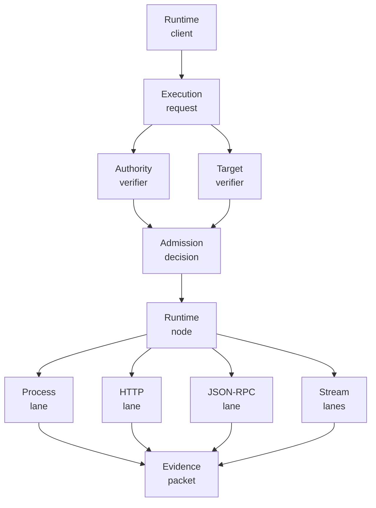
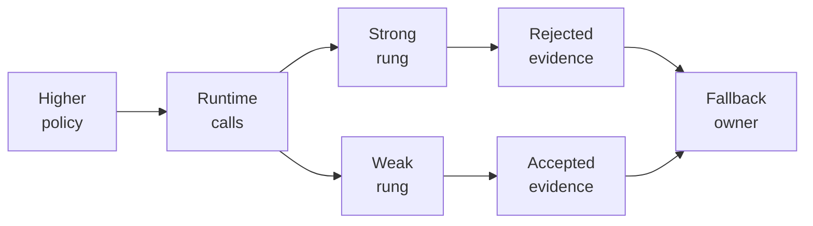
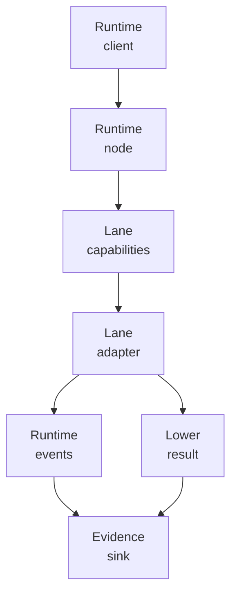
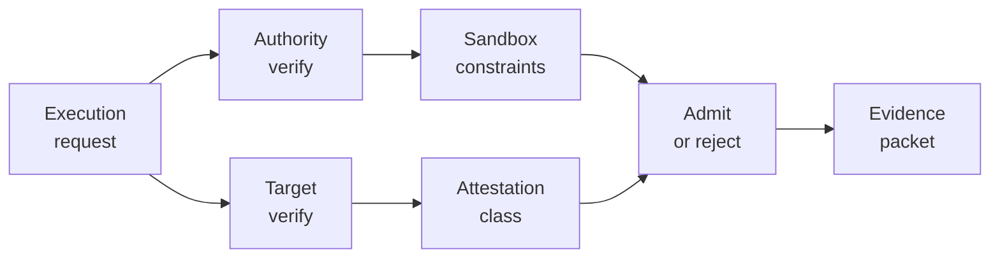

<p align="center">
  
</p>

<p align="center">
  <a href="https://github.com/nshkrdotcom/execution_plane">
    
  </a>
  <a href="https://github.com/nshkrdotcom/execution_plane/blob/main/LICENSE">
    
  </a>
</p>

# Execution Plane Workspace

This repository is a non-umbrella Mix workspace. The repository root is a
tooling project only; it is not the `execution_plane` Hex package.

The public `execution_plane` 0.1.0 Hex package is generated with released Weld
0.8.2 from three independently testable source units:

- `core/execution_plane`
- `protocols/execution_plane_jsonrpc`
- `runtimes/execution_plane_process`

Blitz, Weld, and workspace orchestration live only in the root tooling project
and do not enter the generated runtime dependency graph. Canonical changes stay
in the component source homes; `projection/execution_plane` is generated
release evidence.

Execution Plane is the lowest runtime substrate in the ranked stack. It owns
packets, lane protocols, placements, target attestations, runtime-client
contracts, and raw lower evidence. It does not own product intent, governance
policy, connector semantics, or durable workflow truth.

## Stack Position

```text
products / AppKit / Mezzanine / Citadel / Jido Integration
  -> ExecutionPlane.Runtime.Client
      -> execution_plane_node
          -> process, HTTP, JSON-RPC, SSE, WebSocket, terminal lanes
              -> concrete runtimes and targets
```

Higher layers decide why something should run and what authority applies.
Execution Plane decides whether a lower execution request is structurally
valid, whether the target and attestation are acceptable, which lane can carry
the request, and what lower evidence packet describes the result.

The node is intentionally lane-neutral. It can route to registered lanes and
verified targets, but it must not invent fallback ladders or infer business
semantics. If a policy owner allows multiple target classes, that owner issues
separate runtime-client calls and records each rejected or accepted rung.

## What The Public Distribution Carries

The generated `execution_plane` package carries shared lower values and
behaviours plus JSON-RPC framing and the process runtime:

- admission requests, decisions, and rejections
- authority refs and host-registered authority verifiers
- sandbox profiles and acceptable attestation classes as opaque policy data
- target descriptors, target attestations, target clients, and target verifiers
- execution requests, results, events, refs, evidence, and provenance
- placement descriptors for local, SSH, and guest targets
- lane adapter behaviours and capability descriptions
- lower-boundary simulation and conformance helpers
- JSON-RPC framing and correlation
- process, PTY, stdio, guest-bridge, and lower-simulation transport surfaces

The common package does not enforce an OS sandbox by itself. It carries policy
and evidence. Real isolation claims must come from a verified target and a
lane/host implementation that can substantiate the attestation.

## Current Delivery State

The current checkout has a usable common package, process lane, HTTP lane,
JSON-RPC lane, SSE/WebSocket stream lanes, runtime node, and operator-terminal
package. StackLab currently proves node composition through local process/HTTP
execution, target-attestation rejection, authority rejection, and Jido
Integration-owned fallback evidence.

Recent work fixed dependency-source fallback behavior, added the local TRE Rhai
runner lane under the process package, added target posture attach contracts,
required lower authority refs, governed process environment inheritance, and
cleaned up atom/regex/env hazards.

The Synapse governed-effect lift adds the deterministic diagnostic lane used by
StackLab staged-live proof. `ExecutionPlane.Lanes.DiagnosticLane` validates a
lower execution request, runs the selected diagnostic action, applies timeout
and output-size limits, and returns an `ExecutionPlane.DiagnosticResult` through
the common execution result shape. It is deliberately provider-neutral: higher
layers decide authority, product meaning, and connector placement; Execution
Plane only owns lower request validation, lane execution, and result evidence.

The cross-stack conformance command is:

```bash
cd /home/home/p/g/n/stack_lab
MIX_ENV=test mix stack_lab.synapse.staged_live.v1 --json
```

Maintainers should read
[Code Smell Remediation](guides/code_smell_remediation.md) before changing
subprocess transport state, public starts, OS command ownership, file spooling,
or guest bridge state.

## Runtime Diagrams





## Developer Flow Diagrams





## Mix Projects

The checkout contains exactly eight active component Mix projects:

- `core/execution_plane`: common substrate selected into `execution_plane`
- `protocols/execution_plane_http`: unary HTTP lane
- `protocols/execution_plane_jsonrpc`: JSON-RPC framing and correlation,
  selected into `execution_plane`
- `streaming/execution_plane_sse`: SSE framing and stream lifecycle lane
- `streaming/execution_plane_websocket`: WebSocket handshake/frame lane
- `runtimes/execution_plane_process`: process/PTY/stdio lane selected into
  `execution_plane`, and the sole owner of `erlexec`
- `runtimes/execution_plane_node`: lane-neutral runtime node and local
  `ExecutionPlane.Runtime.Client`
- `runtimes/execution_plane_operator_terminal`: operator-facing terminal
  runtime, kept separate so base consumers do not inherit `ex_ratatui`

The root `mix.exs` is `:execution_plane_workspace`; it exists to run Blitz
workspace tasks, Weld projection/release tasks, root documentation, and
repository-level checks.

## Installing Packages

Add the common substrate package when you need contracts, codecs, placement
descriptors, runtime-client behaviours, evidence envelopes, and pure helpers:

```elixir
def deps do
  [
    {:execution_plane, "~> 0.1.0"}
  ]
end
```

Version 0.1.0 already includes JSON-RPC and process execution. Separate lane
or host packages are added only for capabilities outside that frozen public
foundation, for example the node host:

```elixir
def deps do
  [
    {:execution_plane, "~> 0.1.0"},
    {:execution_plane_node, "~> 0.1.0"}
  ]
end
```

Downstream SDK users normally should not add Execution Plane deps manually.
For example, CLI provider SDKs get local subprocess execution transitively
through `cli_subprocess_core`, and REST/GraphQL-only SDKs should stay above
their HTTP or GraphQL family kit.

## Development

Run the workspace gate from the repository root:

```bash
mix deps.get
mix ci
```

The root gate uses Blitz to run package-local `mix ci` aliases for every
active package. Package gates can still be run directly:

```bash
cd core/execution_plane && mix ci
cd protocols/execution_plane_http && mix ci
cd protocols/execution_plane_jsonrpc && mix ci
cd streaming/execution_plane_sse && mix ci
cd streaming/execution_plane_websocket && mix ci
cd runtimes/execution_plane_process && mix ci
cd runtimes/execution_plane_node && mix ci
cd runtimes/execution_plane_operator_terminal && mix ci
```

## Publishing

Prepare the public package from the repository root, then inspect the generated
distribution:

```bash
mix weld.inspect --artifact execution_plane
mix weld.project --artifact execution_plane
mix weld.verify --artifact execution_plane
mix release.prepare --artifact execution_plane
```

The package directory is `dist/monolith/execution_plane`, and the durable
generated branch is `projection/execution_plane`. Real Hex publication and the
post-publication tag are human-owned release actions. Publish the generated
`execution_plane` package before any separate lane or host package that depends
on it.

## Sandbox And Target Honesty

The common contracts carry `ExecutionPlane.Sandbox.Profile` and
`ExecutionPlane.Sandbox.AcceptableAttestation` values as opaque policy and
target-selection data. They do not enforce a sandbox by themselves.

`local-erlexec-weak` means local process execution with weak local
attestation. It is not a container, microVM, or cryptographic isolation claim.
Stronger target classes must be backed by a host-owned verifier and target
protocol evidence before they enter the node routing table.

## License

MIT

## Persistence Documentation

See `docs/persistence.md` for tiers, defaults, adapters, unsupported selections, config examples, restart claims, durability claims, debug sidecar behavior, redaction guarantees, migration or preflight behavior, and no-bypass scope when applicable.

## Trial Replay & Scoring Lane Role

Execution Plane executes replay and scoring lanes for Chassis Evolution
candidates. `Chassis.Evolution.Scorer` can invoke Execution Plane lanes to
replay a failure batch and baseline cases against an isolated trial worker,
then return bounded lane evidence to Chassis and Mezzanine for scoring
reduction. Lane jobs remain sandboxed replay jobs with explicit authority,
target, timeout, output bounds, and evidence packet refs.

## ExecutionPlane Executes; Chassis Provisions

Chassis provisions the isolated trial runtime, host placement, mount posture,
release/image candidate, and rollback checkpoints. Execution Plane runs the
lanes. Chassis does not own job execution semantics; Execution Plane does not
own substrate placement, Chassis receipts, or candidate promotion authority.
